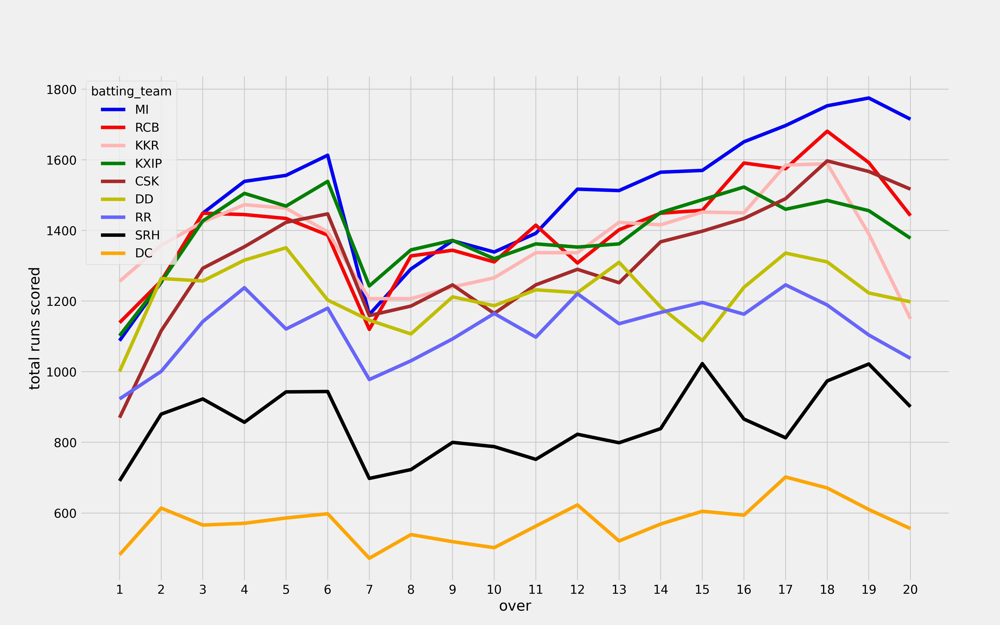

# IPL_Data_Analytics
 Analyzing IPL data with some cool matplotlib graphs

## Find some example plots here  

+ Favourite Gound

 
 + Highest individual score 

 
 
 + Runs per over

+ Score Distributions
 
 
 
 + Highest scored bats man  

+ Runs ( 1's , 2's , 4's , 6's ) 
 
 
 
 Thank you..
